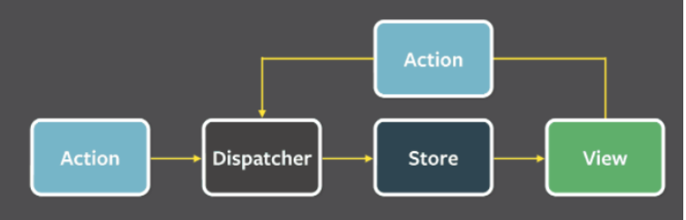

# Redux

## Wstęp

Redux został stworzony w 2015 roku jako implementacja architektury Flux, razem z narzędziem pozwalającym na "podróż w czasie". Redux to również odpowiedź na problem globalnego zarządzania stanem i wprowadzenie do architektury facebooka pojedynczego źródła prawdy.

Słowo Flux oznacza strumień albo przepływ, jego podstawa to wzorzec projektowy CQRS (Command Query Responsibility Segregation). W wolnym tłumaczeniu oddzielanie komend od rozkazów. W Reduxie polega to na oddzieleniu kodu odpowiedzialnego za pobieranie danych od tych związanych z modyfikacją stanu. <br />
Inspiracją do zastosowania architektury Flux jest też zasada Pareta, która mówi o tym, że 20% obiektów jest związane z 80% zasobów. Innymi słowy 20% ludzi tworzy content, a 80% jest konsumentami tego contentu. Architektura Flux przewiduje istnienie 3 części:

- Dispatcher (głośnik) - część odpowiedzialna za odbieranie akcji i rozsyłanie ich do odpowiednich storów.
- Store (magazyn) - odpowiada za przechowywanie informacji
- View (źródło) - widok jest źródłem akcji <br />

Informacje zawsze płyną w jednym (zawsze tym samym kierunku). Możliwe są tylko operacje jednokierunkowe. Z zewnątrz możemy odczytać tylko zawartość store, nie można go modyfikować. Zmiany zawartości stora, możliwe są tylko przez przesyłanie akcji przez dispatcher.<br />
<br/>

## Filozofia reduxa

Filozofia reduxa składa się z 3 głównych zasad:

1. Globalny stan aplikacji przechowywany jest w jednym storze (jedno źródło prawdy),
2. Stan jest tylko do oczytu i można go zmieniać tylko przez nagłośnione (zdispatchowane) akcje.
   Nie możemy modyfikować stanu bezpośrednio. Akcje przechodzą przez punkt centralny, kolejkowane i wykonywane w kolejności wywołania. Dzięki temu elminujemy wyścigi.
3. Zmiany odbywają się tylko przesz pure functions (reducer). Czyste funkcje to takie, które nie zależą od niczego innego oprócz przekazywanych do nich parametrów. Dzięki temu ich wywołanie z tymi samymi parametrami zwróci zawsze taki sam wynik. <br />
   Do reducera przekazujemy poprzedni stan i akcję (czasem akcję z payloadem). Stan zwracany z reducera zawsze musi być całkowicie nowym obiektem. Przy prostym stanie nie jest to skomplikowane. Natomiast przy stanie, który jest obiektem, tablicą albo tablicą obiektów może to być bardziej skomplikowane. Na szczęście będziemy korzystać z redux-toolkita (zbiór narzędzi do reduxa), który wykorzystuje bibliotekę immer, która obsługuje zwracanie zawsze nowego stanu za nas.

## Wskazówki

Częstym błędem jest przenoszenie całego stanu do reduxa. Musisz pamiętać, że w Redux trzymamy TYLKO stan globalny, czyli stan o którym musi wiedzieć wiele komponentów. <br/>
Pamiętaj że w hooku useState nie ma nic złego i nadal warto go używać ;) <br />
Kiedy używać reduxa?

1. Dane są zbierane z wielu komponentów i będą używane przez wiele komponentów w przyszłości.
2. Stanu używamy w wielu komponentach, w sąsiedztwie komponentu, będziemy używać stanu w wielu komponentach jednocześnie.
3. Funkcjonalność jest krytyczna w aplikacji i przyda się umiejętność "podróży w czasie" w celu debugowania. Do tego można użyć wtyczki do Reduxa [redux dev tools](https://chrome.google.com/webstore/detail/redux-devtools/lmhkpmbekcpmknklioeibfkpmmfibljd). Dzięki wtyczce możemy dokładnie prześledzić każdą zmianę, akcję i prześledzić zmiany stanu. Wtyczka umożliwia też logowanie akcji i stanów.

## Praca z reduxem

Na początek instalujemy paczki, od razu będziemy korzystać z toolkita:

```
npm install --save react-redux @reduxjs/toolkit
```

W pracy z redux zawsze kierujemy się trzema krokami:

1. Tworzymy store.
2. Definiujemy akcje.
3. Piszemy reducery.

Redux toolkit został napisany przez niezależnych developerów jako narzędzia do ułatwienia z nim pracy. Twórcy Reduxa polecają ją i rekomendują w swojej dokumentacji.
Redux toolkit upraszcza pisanie aplikacji z wykorzystaniem Reduxa i jego największe bolączki czyli:

1. Konfigurowanie redux store było zbyt skomplikwane.
2. Redux wymaga wiele boilerplate code.
3. Żeby redux był użyteczny i łatwy w obsłudze należy dodać wiele paczek.<br />

Proces tworzenie reducerów i działania na wycince stanu ogranicza się do jednego pliku:

```js
import { createSlice } from '@reduxjs/toolkit'
import type { PayloadAction } from '@reduxjs/toolkit'
import type { RootState } from '../redux'

interface CounterState {
  value: number
}

const initialState: CounterState = {
  value: 0,
}

export const counterSlice = createSlice({
  name: "counter", //nazwa reducera
  initialState,
  reducers: {
    //akcje
    incremented: (state) => {
      state.value += 1;
    },
    decremented: (state) => {
      state.value -= 1;
    },
    incrementByAmount: (state,action:PayloadAction<number>)=>{
        state.value+=action.payload;
    }
  },
});
```
W akcjach mutujemy stan, ale redux toolkit dzięki bibliotece immer, wykrywa te zmiany i produkuje za każdym razem nowy stan. <br />
```js
export const { incremented, decremented,incrementByAmount } = counterSlice.actions;
//nasz własny selector do wyciągania części przechowywanego stanu, można go później wiele razy użyć zamiast pisać za każdym razem useSelector
export const selectCount=(state:RootState)=>state.counter.value
export default counterSlice.reducer;
```
W pliku index.ts tworzymy store
```js 
import { combineReducers } from "redux";
import { configureStore } from "@reduxjs/toolkit";

const reducer = combineReducers({
  counter: counterReducer,
});
export const store = configureStore({ reducer });
```

Za pomocą funkcji configureStore wrzucamy obiekt, który będzie w przyszłości łączył wszystkie slice w jeden stan. Potem podobnie jak w ContextApi podpinamy store do Providera.

```js
import { Provider } from "react-redux";
import { store } from "./redux/toolkitSlice";

<Provider store={store}>
  <App />
</Provider>;
```

Dzięki temu możemy wyciągnąć stan i akcje bezpośrednio w komponencie za pomocą hooków useSelector i useDispatch.

```js
import { useDispatch, useSelector } from "react-redux";
import { decremented, incremented } from "./redux/toolkitSlice";

const App2 = () => {
  const dispatch = useDispatch();
  const counter = useSelector((state) => state.value);

  return (
    <div>
      <button onClick={() => dispatch(decremented())}>-</button>
      <span>{counter}</span>
      <button onClick={() => dispatch(incremented())}>+</button>
    </div>
  );
};

export default App2;
```

Przejdźmy teraz do rozbudowanego store z wieloma reducerami, stwórzmy plik authSlice.js:

```js
import { createSlice } from "@reduxjs/toolkit";
import type { PayloadAction } from '@reduxjs/toolkit'

export const authSlice = createSlice({
  name: "auth",
  initialState: {
    authToken: "",
  },
  reducers: {
    login: (state, action:PayloadAction<string>) => {
      state.authToken = action.payload;
    },
    logout: (state) => {
      state.authToken = "";
    },
  },
});

export const { login, logout } = authSlice.actions;
export default authSlice.reducer;
```

Modyfikujemy plik index.ts i dodajemy authReducer do store, będący w przyszłości źródłem prawdy dla całej aplikacji.

```js
import { combineReducers } from "redux";
import { configureStore } from "@reduxjs/toolkit";
import counterReducer from "./counterSlice";
import authReducer from "./authSlice";

const reducer = combineReducers({
  counter: counterReducer,
  auth: authReducer,
});
export const store = configureStore({ reducer });
// dodajemy dodatkowe hooki i typy do zabezpieczenia reduxa
// typescript wywnioskuje RootState z store
export type RootState = ReturnType<typeof store.getState>;
export type AppDispatch = typeof store.dispatch;

```
Teraz o wiele lepiej niż używać useDispatch i useSelector stworzyć nasze otypowane hooki dla danego slice. Najpierw stwórzmy same typy dla useDispatch i useSelector, aby nie trzeba było za każdym razem dla useSelectora otypowaywać (state:RootState), a dla useDispatcha zapomnieć o konieczności otypowania tego jako AppDispatch. Stwórzmy plik redux/hooks.ts:

```js
import { useDispatch, useSelector } from "react-redux";
import type { TypedUseSelectorHook } from "react-redux";
import type {AppDispatch} from "./index"
export const useAppDispatch: () => AppDispatch = useDispatch;
export const useAppSelector: TypedUseSelectorHook<RootState> = useSelector;
```

Użycie nowych hooków w komponencie:
```js
import React, { useState } from 'react'

import { useAppSelector, useAppDispatch } from 'app/hooks'

import { decrement, increment,selectCount } from './counterSlice'

export function Counter() {
  const count = useAppSelector((state) => state.counter.value)
  //alternatywnie
  //const count = useAppSelector(selectCount)
  const dispatch = useAppDispatch()
}
```

## Redux toolkit query
[redux za pomocą redux toolkit](https://www.youtube.com/watch?v=iBUJVy8phqw)
[dokumentacja redux toolkit query](https://redux-toolkit.js.org/tutorials/rtk-query)