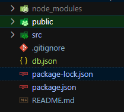
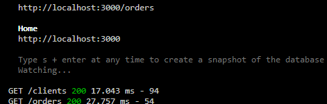

# Najczesciej uzywane biblioteki cz.2

## Mockowanie odpowiedzi z serwera

Czasem w fazie rozwoju aplikacji potrzebne jest zamockowanie odpowiedzi z serwera, aby przyspieszyć jej rozwój. Na początek możemy skorzystać z biblioteki [json-server](https://github.com/typicode/json-server) stworzyć sztuczne odpowiedzi z serwera i sztuczną obsługę naszych zapytań. JSON-serwer pozwala zrobić sztuczne REST API poniżej 30 sekund. Na początek zainstalujmy to narzędzie

```
npm i json-server
```

Teraz w folderze głównym naszej aplikacji stwórzmy plik db.json<br/>


Teraz możemy wypełnić ten plik danymi. Będziemy operować na formacie json. Podobnie jak w nierelacyjnej bazie danych. Wszystko zamykamy w jednym obiekcie, a następnie klucze główne są odpowiednikami endpointów lub tabel w bazie danych. Tablice w kluczach głównych to dane, które zostaną nam zwrócone

```json
{
    "clients": [{ "id": 1, "name": "json-server", "email": "test@test.pl", "age": 33 }],
    "orders": [{ "id": 1, "body": "zamawiam drewno" }]
}
```

Po wypełnieniu pliku sztucznymi danymi, w konsoli możemy uruchomić json-serwer komendą:

```js
npx json-server --watch db.json
```

Json serwer stworzył nam dwa endpointy /clients i /orders, które zwracają dane wprowadzone przez nas w pliku.
<br/>
Po wejściu w przeglądarce na localhost:3000/clients otrzymamy dane.

## Obsługa API

Wykorzystajmy json-serwer aby poćwiczyć proste zapytania do API za pomocą fetcha. W bardziej skomplikowanych przypadkach możemy też skorzystać z biblioteki [axios](https://github.com/axios/axios).
Głównie będziemy korzystać z 4 metod protokołu HTTP:

-   GET - pobieranie danych,
-   POST - wysłanie danych,
-   PUT - aktualizacja danych,
-   DELETE - usunięcie danych,

W drugiej konsoli uruchamiam aplikację w react, jako że port 3000 jest zajęty przez json-serwer aplikacja uruchomi się prawdopodobnie na porcie 3001. <br />
Pobierzmy dane dla pojedyńczego zamówienia

```js
import React, { useEffect, useState } from "react";
import { useParams } from "react-router-dom";

const getSingleOrder = async (orderId: string) => {
    const response = await fetch(`http://localhost:3000/orders/${orderId}`);
    if (!response.ok) {
        return [];
    }
    const data = await response.json();
    return data;
};

export const SingleOrder = () => {
    const param = useParams();
    const [data, setData] = useState([]);

    useEffect(() => {
        getSingleOrder(param.orderId).then((data) => {
            setData(data);
        });
    }, []);

    return <div>{data?.body}</div>;
};
```

Funkcja GetSingleOrder została wyrzucona poza komponent, ponieważ czasem spotyka się wzorzec tworzenia serwisów do pobierania danych, czyli pliku w tym przypadku o nazwie orderService. <br />
Json-serwer zapisuje też do pliku wysłane do niego dane. Dzięki niemu możemy też przetestować dodawanie nowego zamówienia, a później sprawdzić czy na stronie z wszystkimi zamówieniami, zamówienie się pojawi. <br />
Tworzymy komponent AddOrder (implementację tego za pomocą formularza pozostawiam Tobie ;)

```js
import React from "react";

export const addOrder = async (newOrder) => {
    const response = await fetch(`http://localhost:3000/orders`, {
        method: "POST",
        headers: { "Content-type": "application/json;charset=UTF-8" },
        body: JSON.stringify(newOrder),
    });
    if (!response.ok) {
        return {};
    }
    const data = await response.json();
    return data;
};

export const AddOrder = () => {
    const handleAdd = () => {
        addOrder({ body: "poproszę wodę" }).then((data) => {
            console.log("success", data);
        });
    };
    return <button onClick={handleAdd}>Add order</button>;
};
```

Po otworzeniu endpointa w przeglądarce pojawi się nowy wpis. Przygotowałem Ci też funkcję do pobierania wszystkich zamówień oto ona:

```js
export const getAllOrders = async () => {
    const response = await fetch(`http://localhost:3000/orders`);
    if (!response.ok) {
        return [];
    }
    const data = await response.json();
    return data;
};
```

Po zaimplementowaniu widoku wszystkich zamówień zauważysz, że po dodaniu zamówienia. Mimo tego, że jest ono w bazie danych nie zawsze pojawi się na widoku od razu. Związane jest to z tym, że react sam z siebie nie wie kiedy odświeżać zapytania. Możemy przechowywać stan osobno po stronie klienta i po stronie serwera, ale nie zawsze jest to najlepszym pomysłem. Odpytywanie serwera co chwilę w celu sprawdzenia czy mamy aktualne dane nie sprawdzi się też w dużej skali. Dlatego w kolejnym podrozdziale zajmiemy się cachowaniem zapytań i ich rewalidacją.

Przykłady dla PUT i DELETE:

```js
const getClientById = async (id) => {
    const response = await fetch(`http://localhost:3000/clients/${id}`);
    const data = await response.json();
    return data;
};

const updateClientById = async (updateClientData, id) => {
    const response = await fetch(`http://localhost:3000/clients/${id}`, {
        method: "PUT",
        headers: { "Content-type": "application/json;charset=UTF-8" },
        body: JSON.stringify(updateClientData),
    });
    const data = await response.json();
    return data;
};
```
